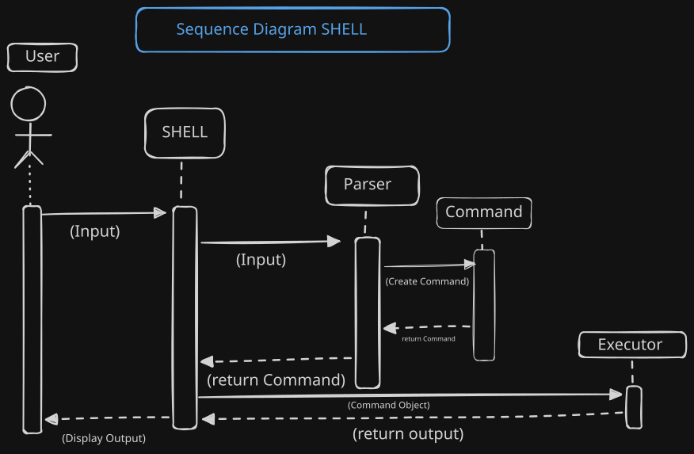
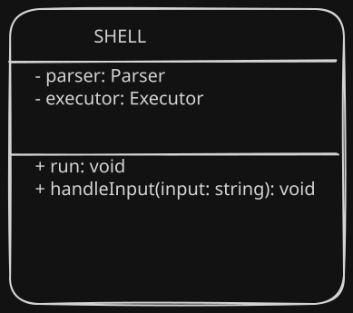
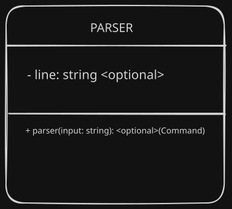
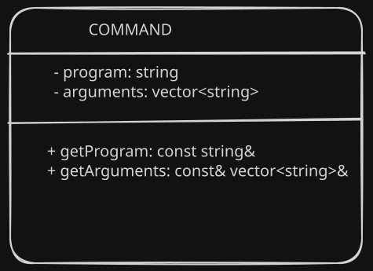
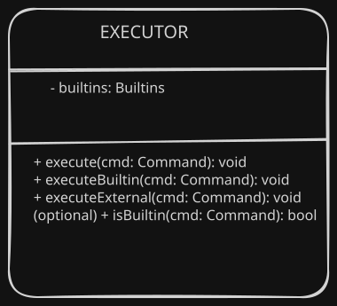
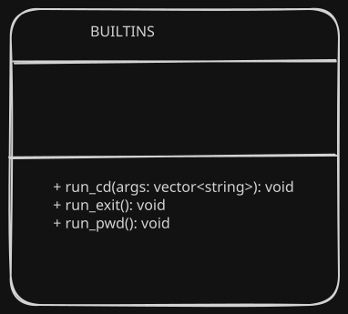

# Modern C++ Mini Shell – Architecture Documentation

This document explains the internal design, structure, and component interactions of the Modern C++ Mini Shell project.  
It includes UML diagrams, module descriptions, and execution flow.

All diagrams in this document are exported as separate `.svg` files for clarity, and the full editable board is available as `shell_design.excalidraw` inside the `/diagrams` directory.

---

# 1. High-Level Architecture

The shell follows the classic REPL pattern:


This modular design ensures clarity, maintainability, and clean separation of responsibilities.

---

# 2. Sequence Diagram – Command Execution Flow

The diagram below shows the execution lifecycle:

- User enters a command  
- Shell reads the input  
- Shell hands input to Parser  
- Parser constructs a `Command` object  
- Shell forwards the Command to Executor  
- Executor executes builtin or external programs  
- Output is displayed back to user

### **Sequence Diagram**


---

# 3. Class Diagrams

This section describes each core component of the shell using UML class diagrams.

---

## 3.1 Shell Class

The Shell is responsible for:
- Running the REPL loop  
- Reading user input  
- Triggering parsing and execution  
- Managing lifetime of Parser and Executor  

### **Shell UML**


---

## 3.2 Parser Class

The Parser handles:
- Tokenizing input  
- Validating command structure  
- Constructing and returning a `Command` object using `optional<Command>`

It does **not** store parsed commands internally.

### **Parser UML**


---

## 3.3 Command Class

The `Command` object contains:
- the program name  
- vector of arguments  

It is a pure data structure returned by the Parser.

### **Command UML**


---

## 3.4 Executor Class

The Executor is responsible for:
- Determining if the command is builtin or external  
- Calling the correct builtin handler  
- Using `fork`, `execvp`, and `waitpid` for external commands

It aggregates the `Builtins` component.

### **Executor UML**


---

## 3.5 Builtins Class

The Builtins component implements:
- `cd`
- `pwd`
- `exit`

These commands run **inside the shell process**, without calling `fork()`.

### **Builtins UML**


---

# 4. Component Interaction Diagram (High-Level Modules)

Modules involved:

- **Shell Module**  
- **Parser Module**  
- **Executor Module**  
- **Builtins Module**  
- **System Calls Layer** (fork, execvp, waitpid)

These modules interact without tight coupling, enabling clean extension for features like pipes and redirection.

*(Add your component diagram here if you export it later.)*

---

# 5. Design Principles Applied

The architecture follows:

### ✔ Single Responsibility Principle (SRP)
Each class handles exactly one core responsibility.

### ✔ Separation of Concerns
Parsing, execution, builtins, and REPL logic are isolated and easy to test.

### ✔ Composition Over Inheritance
Shell owns Parser and Executor.

### ✔ Modern C++ Techniques
- `optional`
- `vector`
- RAII
- clear ownership rules
- no global state

---

# 6. Future Enhancements

Planned features include:

- Pipes (`|`)
- Redirection (`>`, `<`, `>>`)
- Background jobs (`&`)
- Aliases  
- Command history  
- Environment variable expansion  

The current architecture supports adding these features cleanly.

---

# 7. Diagram Source File

All UML diagrams were created in Excalidraw.

Editable source board: ```
../diagrams/shell_design.excalidraw
---

# 8. Conclusion

This architecture provides a robust, extensible foundation for a modern Unix-like shell implemented in C++.  
It is cleanly structured, uses modern language features, and is easy to maintain and extend.
